Визуальный граф сцены `scene_02` из [[вступления.yarn]] (тот же текст в прозе — [[вступления.md]] / [[Диалоги/вступления.md]]).

```mermaid
flowchart TD
    classDef choice fill:#3a3a5e,stroke:#8888ff,color:#fff
    classDef ctrl fill:#2f2f2f,stroke:#888,color:#ccc,stroke-dasharray: 3 3
    classDef scene fill:#1f3a2e,stroke:#4caf50,color:#fff

    subgraph SQ["Площадь перед Академией"]
        A["Приезд: автобус, площадь, ворота Академии"]
        B["Внутренний монолог: скрывает, что он Первородный"]
        Cshow[["Алина: show"]]:::ctrl
        D["Алина окликает ГГ, объятия — «Ты поступил!»"]
        E{"Алина: Уже знаешь, где будешь жить?"}
        F["Пошли в администрацию (+ шутка про чемодан)"]
        A --> B --> Cshow --> D --> E
        E -->|"Нет. Только приехал."| F
        E -->|"Только что сошёл с автобуса."| F
    end

    subgraph SA["Административный корпус"]
        Vshow[["Виктория: show"]]:::ctrl
        G["Видят Викторию у терминала с расписанием"]
        Cl_show[["Сотрудница: show"]]:::ctrl
        H["Проверка документов"]
        I["Виктория замечает документ, подходит"]
        J{"Виктория: Ты человек?"}
        K1["Виктория: Интересно."]
        K1a["Виктория: Хм. Значит, всё-таки да."]
        L["Знакомство: имена, рукопожатие"]
        M["Сотрудница выдаёт общагу №3, комнату 314"]
        Cl_hide[["Сотрудница: hide"]]:::ctrl
        N["Алина: Поздравляю / Теперь ты студент Академии"]
        V_hide[["Виктория: hide"]]:::ctrl

        F --> Vshow --> G --> Cl_show --> H --> I --> J
        J -->|"Похоже, документы меня выдали."| K1
        J -->|"А ты как думаешь?"| K1a --> K1
        K1 --> L --> M --> Cl_hide --> N --> V_hide
    end

    subgraph SD["Общежитие №3, комната 314"]
        O["Идут к общаге, шутки про душевые"]
        P["Заселение в комнату 314"]
        Q{"Что разложить сначала?"}
        R["Комната обжита (книги на полке и т.д.)"]
        S["Алина смотрит на часы — «Чёрт»"]
        T["Алина уходит к куратору клуба (шутка про «потерялся на выпускном»)"]
        Ahide[["Алина: hide"]]:::ctrl
        U["ГГ один в комнате — осознание новой жизни"]
        W["Желудок напоминает о себе -> решение идти на кухню"]
        X[["jump: scene_03 (кухня)"]]:::scene

        V_hide --> O --> P --> Q
        Q -->|"Разложить одежду в шкаф"| R
        Q -->|"Сначала достать ноутбук"| R
        R --> S --> T --> Ahide --> U --> W --> X
    end

    class E,J,Q choice
```

Ромбы `{}` — точки выбора игрока (реплики `->` в yarn). Двойные скобки `[[ ]]` — команды `<<character CharacterControl ... "show"/"hide">>`. Все ветки выбора в этой сцене декоративные — они не расходятся по сюжету, а сразу сходятся в одну точку.

## Легенда

- **Прямоугольник** — нарративный бит/реплика (может объединять несколько строк оригинала).
- **Ромб** (синий) — точка выбора игрока.
- **Пунктирный блок** — техническая команда `CharacterControl` (появление/исчезновение персонажа на сцене).
- **Зелёный блок** — переход (`jump`) в следующую сцену.

## Источники

- [[вступления.yarn]] — исходный скрипт с ветвлениями и командами показа/скрытия персонажей.
- [[вступления.md]] / [[Диалоги/вступления.md]] — тот же текст в виде прозы (без указания вариантов выбора).
