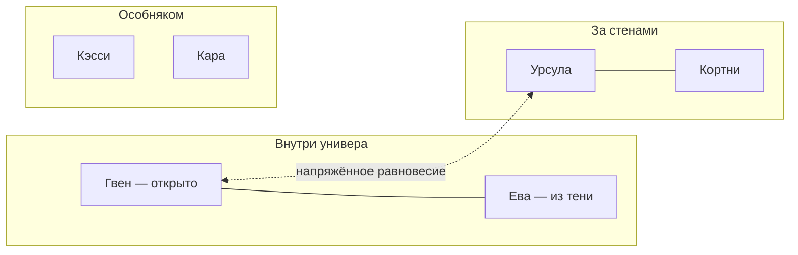

# Персонажи

| Персонаж | Вид | Возраст | Роль |
|---|---|---|---|
| [[ГГ]] (`{$username}` / `ГГ`) | человек, Первородный | 1 курс | протагонист |
| [[Ева]] | кошка | 19 | подруга детства, тайно влюблена |
| [[Гвен]] | собака (немецкая овчарка) | 20, 2 курс | студлидер |
| [[Кортни]] | белка | 20 | спортсменка, романтический интерес |
| [[Урсула]] (в игре — Урса) | бурый медведь | 20, старшекурсница | влияние вне стен универа |
| [[Кэсси]] | летучая мышь (бурый ушан) | 20 | художница, отдельная фигура |
| [[Кара Божья]] | орёл (беркут), M | 20 | сосед по 314, комик-реллиф |
| [[Вершинин]] | рогатый (вид не назван) | — | профессор, куратор эксперимента |
| [[Носитель]] / вор | зверолюдь (вид ?) | ~20 | антагонист второй половины |

## Круги

- [[Гвен]] (внутри универа, открыто) + [[Ева]] (помогает из тени)
- [[Урсула]] (за стенами) + [[Кортни]] (подруги)
- Гвен и Урсула — напряжённое равновесие
- [[Кэсси]] и [[Кара Божья|Кара]] — особняком

## Кто где живёт

Все — в Общежитии №3. [[ГГ]] и [[Кара Божья|Кара]] — 314; [[Кэсси]] — через стену; [[Урсула|Урса]] — соседка по блоку; [[Гвен]] — в том же корпусе; у [[Ева|Евы]] и [[Кортни]] — полки в общем холодильнике.

## Правило

Персонажей называть только по имени, без фамилий — см. [[Правила написания диалогов]].
