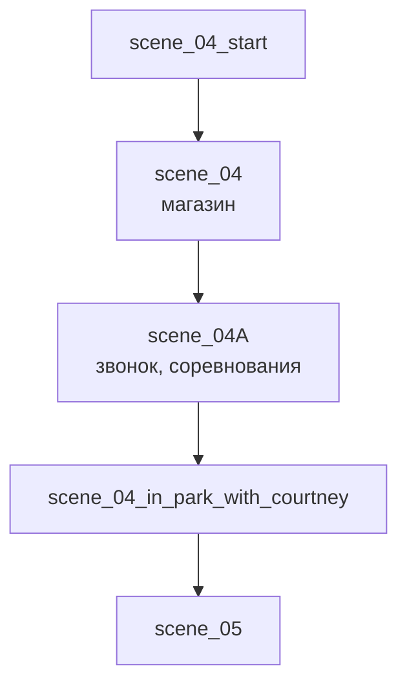

# scene_04 — Сцена 4. Магазин и парк

День 2. После [[scene_03]], дальше — [[scene_05]].

## Ноды

## Что происходит

1. **`scene_04`** — магазин. До стипендии далеко, [[ГГ]] берёт самое необходимое. [[Кортни]] читает состав целиком, шевеля губами: «Двадцать граммов белка на сто. Врут.» Шесть лет ест по расписанию. Предлагает угостить ГГ «за муки» и зовёт в парк.
2. **`scene_04A`** — ей звонят, она дважды сбрасывает: «до соревнований ещё полно времени». «Перед тобой чемпионка по бегу.»
3. **`scene_04_in_park_with_courtney`** — тихое место, которое она любит. Тост. Молча протягивает холодную банку — «Приложи» — так в её мире выглядят извинения. Садится ближе; **камень под футболкой тёплый** («нагрелся на солнце, наверное»).
4. Финал зависит от `$courtney_simpatiya`.

## Выборы

| Опция | Реакция | Последствие |
|---|---|---|
| Лапшу. Для тебя | «Это взятка?» — «Возмещение ущерба. За соседа.» — «Принято. Но бить я его всё равно буду.» | `$shop_item = "lapsha"` → СМС в [[scene_06]] |
| Кебаб и газировку | «Кебаб отсюда? Смелый. Я бью слабее, чем он.» | — |
| Тост: за чудную компанию / за встречу / чтобы никто не напрягал | «А ты забавный.» / «…я бы тебя так не калечила.» / «Вот это я уважаю.» | реакция |
| Удар был на 5 баллов | подкол в ответ | реакция |
| Расскажешь? | «Потом как-нибудь. Но спасибо, что спросил. Обычно меня спрашивают только про секунды.» | реакция |
| И ты решила выместить всю злость? | «Не ходишь потом как невротик.» | реакция |

## Условные блоки

- `$vershinin_doverie < 0` — мысль про выторгованные 10% ([[scene_02]]).
- `$courtney_reluctant` — «Ты идти не хотел. Я заметила.» — «И всё равно пришёл. Это разные вещи.»
- `$courtney_simpatiya >= 2` — «Это за удар. А это за то, что не сбежал.» **Поцелуй в щёку**, задерживается на секунду дольше, «будто принюхивалась» (`$courtney_kiss`). Иначе — тычок кулаком в плечо: «Живи, Первородный.»

> [!note] Изменилось
> Пожилого «боксёра» и опции «Приблизиться» в демо нет. Прежние проблемы со спикерами исправлены.
