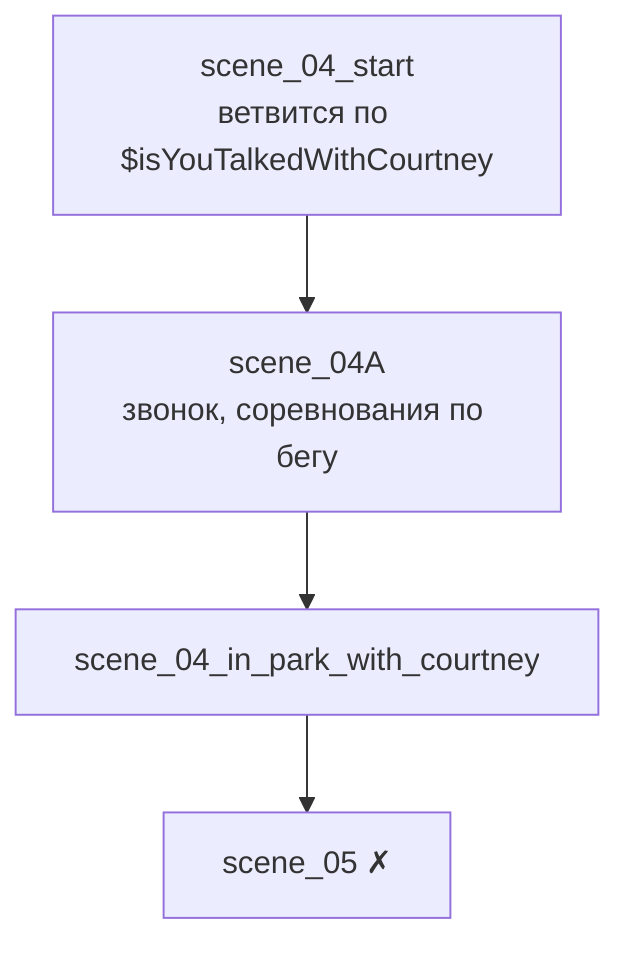

# scene_04

## Ноды

## Что происходит

1. **`scene_04_start`** — магазин. Ветвится по `$isYouTalkedWithCourtney` (ставится в [[scene_03]]).
2. **`scene_04A`** — звонок, соревнования по бегу.
3. **`scene_04_in_park_with_courtney`** — парк: [[Кортни]] извиняется за удар, поцелуй в щёку, пожилой «боксёр» прогоняет.

Все выходы → `scene_05` (отсутствует).

## Правки

В `scene_04_in_park_with_courtney`:

- [ ] Строки «А ты забавный», «За встречу», «За легкую жизнь» без спикера.
- [ ] `{$username}Выйдя…` без двоеточия.
- [ ] Опция `Кортни: Приблизиться` выглядит как реплика.
