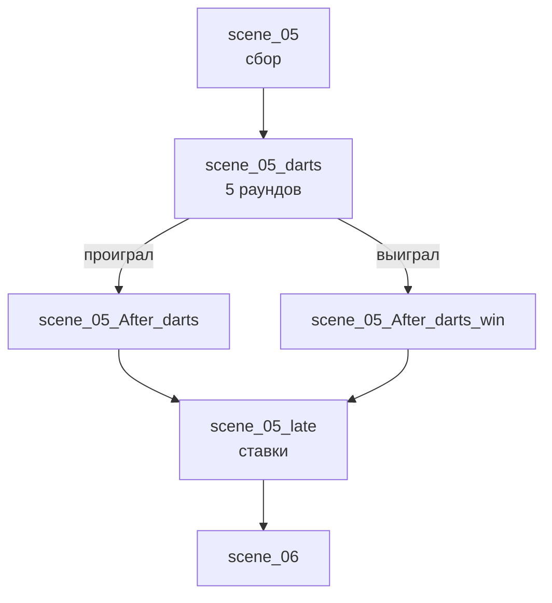

# scene_05 — Сцена 5. Вечеринка и дартс

День 2, вечер. После [[scene_04]], дальше — [[scene_06]]. Первая сцена, где собраны почти все (нет только [[Кортни]] — она на тренировке).

## Ноды

## Что происходит

1. **`scene_05`** — [[Кара Божья|Кара]] даёт концерт в холле, [[Ева]] просит перестать. Приходит [[Гвен]] с тремя жалобами на шум: «Все проблемные лица уже в одном месте». Ева предлагает тихие посиделки в общей комнате, Гвен «официально контролирует уровень шума», а неофициально ей интересно, как ГГ пьёт: «В документах этого не было». Ева приносит сок и, покраснев, бутылку покрепче.
2. Появляется **[[Кэсси]]**: «Вы очень громко думаете.» На ГГ: «А. Тот самый. Без всего лишнего.»
3. Появляется **[[Урсула|Урса]]**: «Меня не позвали, но я всё равно пришла.» Кара зовёт её «соседка».
4. Гвен вызывает ГГ на дартс один на один: проигранный раунд — штрафной глоток, проигравший честно отвечает на один вопрос победителя.
5. **`scene_05_darts`** — мини-игра, пять раундов. Гвен бросает не глядя. Ева пытается остановить спаивание.
6. **Исход.** Проиграл — Гвен приберегает вопрос: «Мне нравится, когда должок висит подольше». Выиграл — ГГ спрашивает сам или приберегает; Гвен: «Ему везло… И один раунд я тебе отдала».
7. **`scene_05_late`** — выясняется, что Урса принимала ставки: Кара поставил на ГГ «всю стипендию», она — «на собаку». Стаканы подливают без счёта.

## Выборы

| Опция | Реакция | Последствие |
|---|---|---|
| Я тут вообще-то живу | «Служебная необходимость. И любопытство. Ну и я тут тоже живу…» | реакция |
| Я в списке жалоб? | «Пока нет. Но вечер только начинается.» | реакция |
| «Без всего лишнего»? | «Тебя удобно рисовать. Чистая форма.» | реакция |
| Мы знакомы? | «Кэсси. Я живу по соседству и слышу всё, о чём ты жалеешь.» | реакция |
| Присаживайся к нам | «Надо же, кто-то тут вежливый.» | `$ursa_simpatiya` → Урса перехватывает стакан в `scene_05_late` |
| Мы тебе помешали? | «Налейте чего покрепче, и будем считать, что мы в расчёте.» | — |
| Идёт / А если я откажусь? | играть придётся в любом случае | реакция |
| Целюсь в двадцатку / Бью наверняка | «Смело. Записываю.» / «Осторожно. Тоже данные.» | `$darts_risky` → реплика Гвен после матча |
| Взять сок / Сделать вид, что не заметил | Ева довольна / «Ну и пожалуйста.» | реакция (только при проигранном раунде) |
| Ты так уверена? | «Уверена. Но мне нравится, что ты споришь.» | — |
| Где ты этому научилась? | «Бар отца. Я там сидела за стойкой с двенадцати лет и считала чужие очки. Это не для протокола.» | `$darts_gwen_secret` → ещё одна реплика |
| Ещё раунд / Может, хватит | доигрывают в любом случае | реакция |
| *(победа)* Тогда мой вопрос | «В твоих документах меньше строк, чем должно быть. И это не твоя вина.» | долг закрыт |
| *(победа)* Приберегу должок | «Так обычно говорю я.» | `$gwen_dolzhna` |

## Условные блоки

- `$kara_poslushal` ([[scene_01]]) — «Ты слышал новый альбом, ты понял!» — Гвен: «Соболезную.»
- `$kara_sdal` / `$lapsha_v_rukah` ([[scene_03]]) — три версии подкола про лапшу и Кортни.
- `$courtney_kiss` ([[scene_04]]) — Гвен знает про парк («У меня папка. У Евы чат общаги. У Кэсси уши.»); Ева: «Мне всё равно. Просто удивилась. Как подруга.» — хвост дважды хлещет по ножке стула.
- `$darts_won` — кто кому платит по ставке; проигрыш ГГ ставит `$gwen_dolg`.

## Крючки

- Вопрос-должок Гвен (в любую сторону) — висит после демо.
- «В твоих документах меньше строк, чем должно быть» — не объяснено, см. [[Открытые вопросы]].
- Урса про ГГ: «Ты только что стоил мне денег. Таких я запоминаю.»
