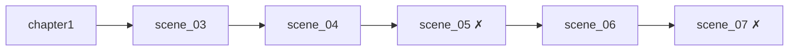

# Сцены (Yarn) — текущее состояние

| Файл | Что происходит | Статус |
|---|---|---|
| [[chapter1]] | приезд, раскрытие Первородного, заселение в 314 | написана, нужны правки |
| [[scene_03]] | кухня, удар, знакомство с Кортни | написана, нужны правки |
| [[scene_04]] | магазин → парк с Кортни | написана, нужны правки |
| `scene_05` | — | **отсутствует** |
| [[scene_06]] | пьяная вечеринка | написана, нужны правки |
| `scene_07` | — | **не написана** |

## Порядок

## См. также

- [[Известные проблемы в текстах]]
- [[Конвенции Yarn]]
- [[Правила написания диалогов]]
