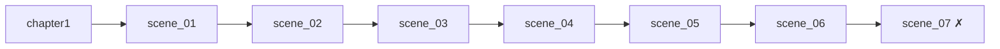

# Сцены (Yarn) — текущее состояние

Демо написано целиком. Канон — текст игры (выгрузка «Все диалоги демо»).

| Сцена | День | Что происходит | Статус |
|---|---|---|---|
| [[chapter1]] — Приезд | 1 | Ева встречает ГГ, Гвен раскрывает Первородного, заселение в 314 | канон |
| [[scene_01]] — Сосед | 1 | знакомство с Карой, краденая лапша | канон |
| [[scene_02]] — Вершинин и камень | 2 | демонстрация артефакта, договор | канон |
| [[scene_03]] — Кортни | 2 | кухня, удар, знакомство | канон, есть правки |
| [[scene_04]] — Магазин и парк | 2 | состав на упаковке, холодная банка, поцелуй в щёку | канон |
| [[scene_05]] — Вечеринка и дартс | 2 | Кэсси, Урса, матч с Гвен, ставки | канон |
| [[scene_06]] — Финал | 2 | камень «гудит», Ева в коридоре, ночные сообщения, когти в дверь | канон |
| `scene_07` | — | продолжение после демо | **не написана** |

## Порядок

## См. также

- [[Известные проблемы в текстах]]
- [[Конвенции Yarn]]
- [[Правила написания диалогов]]
- Что дальше: [[Часть 1 — после демо]]
